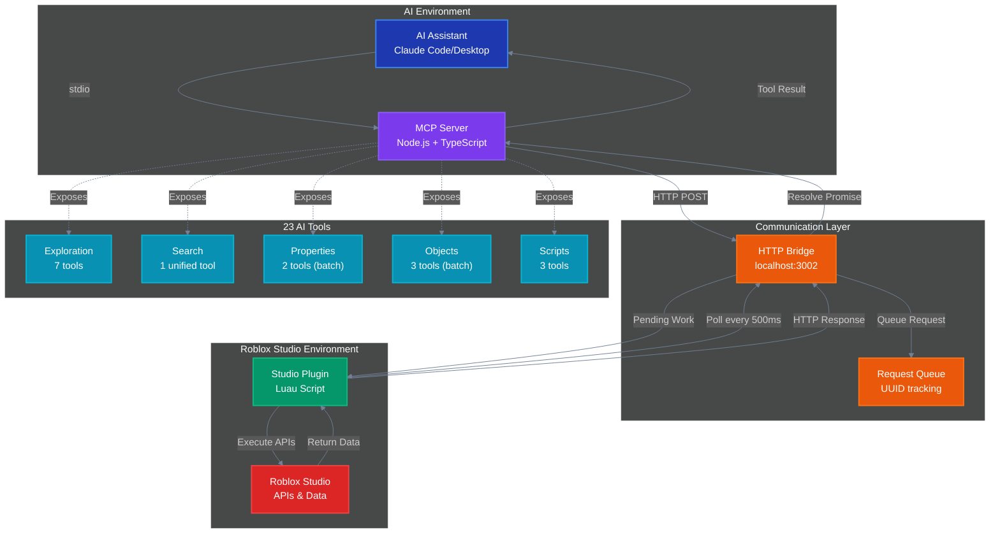
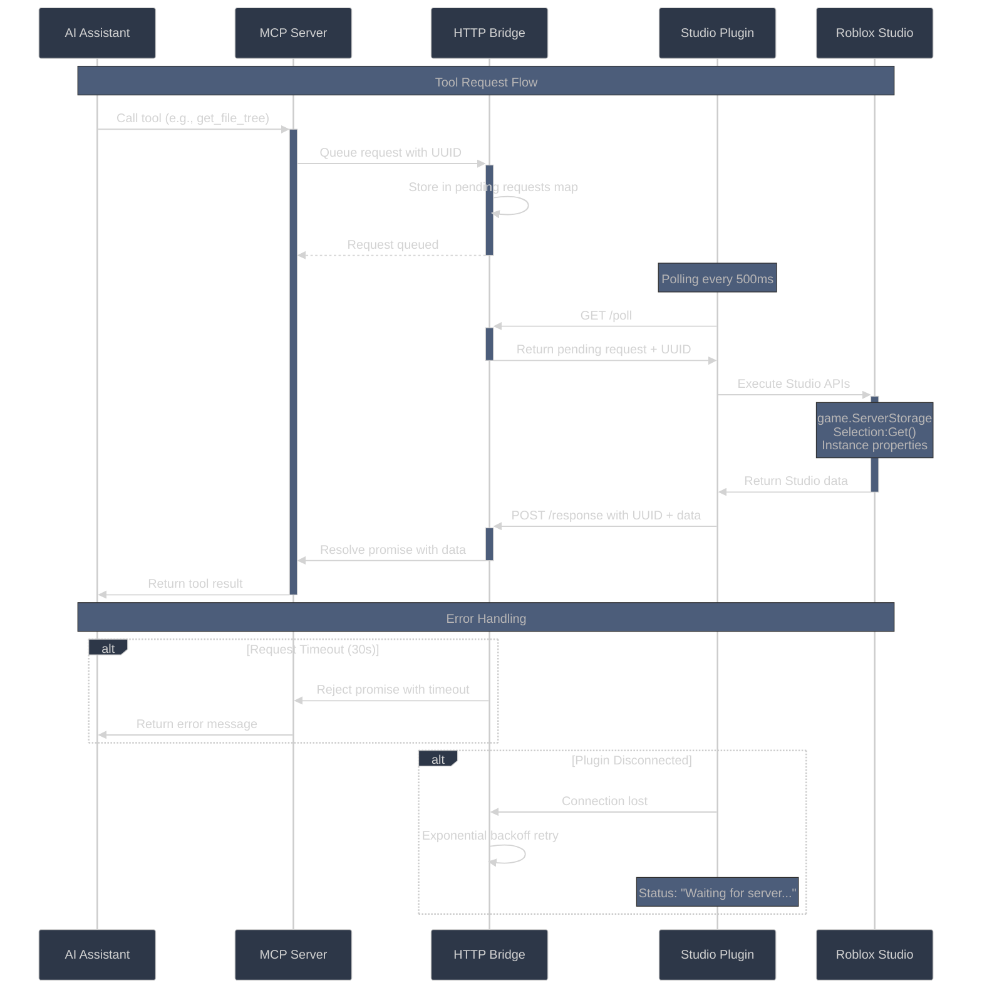

# Roblox Studio MCP Server

MCP server for AI-powered Roblox Studio integration. 23 consolidated tools for exploring projects, analyzing scripts, managing assets, and building games autonomously.

<a href="https://glama.ai/mcp/servers/@boshyxd/robloxstudio-mcp">
  
</a>

## Quick Start

**For Claude Code users:**
```bash
claude mcp add robloxstudio -- npx -y robloxstudio-mcp
```

**For other MCP clients (Claude Desktop, etc.):**
```json
{
  "mcpServers": {
    "robloxstudio-mcp": {
      "command": "npx",
      "args": ["-y", "robloxstudio-mcp"],
      "description": "Advanced Roblox Studio integration for AI assistants"
    }
  }
}
```

<details>
<summary>Note for native Windows users</summary>
If you encounter issues, you may need to run it through `cmd`. Update your configuration like this:

```json
{
  "mcpServers": {
    "robloxstudio-mcp": {
      "command": "cmd",
      "args": ["/c", "npx", "-y", "robloxstudio-mcp@latest"]
    }
  }
}
```
</details>

## Studio Plugin Setup (Required)

The MCP server requires a companion Roblox Studio plugin:

1. **Roblox Creator Store**:
   - Install from: https://create.roblox.com/store/asset/75577477776988
   - Click "Install" - Opens in Studio automatically

2. **Manual download**:
   - Download [MCPPlugin.rbxmx](https://github.com/boshyxd/robloxstudio-mcp/releases/latest/download/MCPPlugin.rbxmx)
   - Save to your `%LOCALAPPDATA%/Roblox/Plugins` folder

3. **Advanced setup**:
   - See [studio-plugin/INSTALLATION.md](studio-plugin/INSTALLATION.md) for other methods

**After installation:**
- Enable "Allow HTTP Requests" in Game Settings > Security
- Click the "MCP Server" button in the Plugins toolbar
- Status should show "Connected" when working

## Asset Tools Setup (Optional)

To use asset search, preview, and insertion tools, you need:

### 1. Open Cloud API Key (for search/details/thumbnail)

1. Go to [Roblox Creator Hub](https://create.roblox.com/dashboard/credentials)
2. Click **"Create API Key"**
3. In **Access Permissions** add **creator-store-products** with **Read** access (creator-store-product:read)
4. Copy your API key

**Set the environment variable in your MCP config:**

**For Claude Code users:**

```bash
claude mcp add robloxstudio --env ROBLOX_OPEN_CLOUD_API_KEY=YOUR_KEY -- npx -y robloxstudio-mcp
```

**For other MCP clients (Claude Desktop, etc.):**

```json
{
  "mcpServers": {
    "robloxstudio-mcp": {
      "command": "npx",
      "args": ["-y", "robloxstudio-mcp"],
      "description": "Advanced Roblox Studio integration for AI assistants",
      "env": {
        "ROBLOX_OPEN_CLOUD_API_KEY": "your-api-key-here"
      }
    }
  }
}
```

### 2. Enable Third-Party Assets (for preview/insert)

To insert assets from the Creator Store into your game:

1. Open your game in Roblox Studio
2. Go to **Game Settings** → **Security**
3. Enable **"Allow Loading Third Party Assets"**

> **Note:** Without this setting, `preview_asset` and `insert_asset` will fail with authorization errors.

## Architecture Overview

Dual-component system bridging Roblox Studio with AI assistants:


```mermaid
%%{init: {'theme':'dark', 'themeVariables': {'primaryColor':'#2d3748', 'primaryTextColor':'#ffffff', 'primaryBorderColor':'#4a5568', 'lineColor':'#718096', 'sectionBkgColor':'#1a202c', 'altSectionBkgColor':'#2d3748', 'gridColor':'#4a5568', 'secondaryColor':'#2b6cb0', 'tertiaryColor':'#319795'}}}%%
graph TB
    subgraph AI_ENV ["AI Environment"]
        AI["AI Assistant<br/>Claude Code/Desktop"]
        MCP["MCP Server<br/>Node.js + TypeScript"]
    end
    
    subgraph COMM_LAYER ["Communication Layer"]
        HTTP["HTTP Bridge<br/>localhost:3002"]
        QUEUE["Request Queue<br/>UUID tracking"]
    end
    
    subgraph STUDIO_ENV ["Roblox Studio Environment"]
        PLUGIN["Studio Plugin<br/>Luau Script"]
        STUDIO["Roblox Studio<br/>APIs & Data"]
    end
    
    subgraph TOOLS ["23 AI Tools"]
        FILE["Exploration<br/>7 tools"]
        SEARCH["Search<br/>1 unified tool"]
        PROPS["Properties<br/>2 tools (batch)"]
        CREATE["Objects<br/>3 tools (batch)"]
        SCRIPTS["Scripts<br/>3 tools"]
    end
    
    AI -->|stdio| MCP
    MCP -->|HTTP POST| HTTP
    HTTP -->|Queue Request| QUEUE
    PLUGIN -->|Poll every 500ms| HTTP
    HTTP -->|Pending Work| PLUGIN
    PLUGIN -->|Execute APIs| STUDIO
    STUDIO -->|Return Data| PLUGIN
    PLUGIN -->|HTTP Response| HTTP
    HTTP -->|Resolve Promise| MCP
    MCP -->|Tool Result| AI
    
    MCP -.->|Exposes| FILE
    MCP -.->|Exposes| SEARCH  
    MCP -.->|Exposes| PROPS
    MCP -.->|Exposes| CREATE
    MCP -.->|Exposes| SCRIPTS
    
    classDef aiStyle fill:#1e39af,stroke:#3b82f6,stroke-width:2px,color:#ffffff
    classDef mcpStyle fill:#7c3aed,stroke:#8b5cf6,stroke-width:2px,color:#ffffff
    classDef httpStyle fill:#ea580c,stroke:#f97316,stroke-width:2px,color:#ffffff
    classDef pluginStyle fill:#059669,stroke:#10b981,stroke-width:2px,color:#ffffff
    classDef studioStyle fill:#dc2626,stroke:#ef4444,stroke-width:2px,color:#ffffff
    classDef toolStyle fill:#0891b2,stroke:#06b6d4,stroke-width:2px,color:#ffffff
    
    class AI aiStyle
    class MCP mcpStyle
    class HTTP,QUEUE httpStyle
    class PLUGIN pluginStyle
    class STUDIO studioStyle
    class FILE,SEARCH,PROPS,CREATE,SCRIPTS toolStyle
```

### Key Components:
- MCP Server (Node.js/TypeScript) - Exposes 23 tools via stdio
- HTTP Bridge - Request/response queue on localhost:3002
- Studio Plugin (Luau) - Polls server and executes API calls
- Smart Caching - Efficient data transfer

## 23 Consolidated Tools

### Exploration (7 tools)
| Tool | Description |
|------|-------------|
| `get_file_tree` | Complete project hierarchy with scripts, models, folders |
| `get_place_info` | Place ID, name, game settings, workspace info |
| `get_services` | All Roblox services and their child counts |
| `get_project_structure` | Smart hierarchy with depth control (recommended: 5-10) |
| `get_instance_properties` | Complete property dump for any object |
| `get_instance_children` | Child objects with metadata |
| `get_class_info` | Available properties/methods for Roblox classes |

### Search (1 unified tool)
| Tool | Description |
|------|-------------|
| `search` | Find instances by name, class, property, or script content |

```typescript
// Search examples
search({ query: "Part", searchType: "name" })
search({ query: "BasePart", searchType: "class" })
search({ query: "true", searchType: "property", propertyName: "Anchored" })
search({ query: "print", searchType: "content" })
```

### Properties (2 tools with batch support)
| Tool | Description |
|------|-------------|
| `get_property` | Get property value(s) - accepts single path or array |
| `set_property` | Set property value(s) - supports formulas, relative ops, batch |

```typescript
// Single or batch property operations
set_property({ paths: "game.Workspace.Part", propertyName: "Transparency", propertyValue: 0.5 })
set_property({ paths: ["Part1", "Part2"], propertyName: "Color", propertyValue: "1,0,0" })
set_property({ paths: ["Part1", "Part2"], propertyName: "Position", operation: "add", component: "Y", propertyValue: 10 })
set_property({ paths: ["Part1", "Part2"], propertyName: "Size", formula: "index * 2" })
```

### Objects (3 tools with batch support)
| Tool | Description |
|------|-------------|
| `create` | Create object(s) with optional properties - single or batch |
| `delete` | Delete object(s) - single or batch |
| `duplicate` | Smart duplicate with patterns, offsets, variations - single or batch |

```typescript
// Create single or batch
create({ objects: { className: "Part", parent: "game.Workspace", name: "MyPart", properties: { Size: "4,1,2" } } })
create({ objects: [{ className: "Part", parent: "game.Workspace" }, { className: "Part", parent: "game.Workspace" }] })

// Duplicate with options
duplicate({ duplications: { instancePath: "game.Workspace.Part", count: 5, options: { namePattern: "Part_{n}", positionOffset: [0, 5, 0] } } })
```

### Scripts (3 tools)
| Tool | Description |
|------|-------------|
| `get_script_source` | Read script source with optional line ranges |
| `set_script_source` | Replace entire script source |
| `edit_script` | Partial edits: replace, insert, or delete lines |

```typescript
edit_script({ instancePath: "game.ServerScriptService.Script", action: "replace", startLine: 5, endLine: 10, content: "-- new code" })
edit_script({ instancePath: "game.ServerScriptService.Script", action: "insert", startLine: 5, content: "print('hello')" })
edit_script({ instancePath: "game.ServerScriptService.Script", action: "delete", startLine: 5, endLine: 10 })
```

### Attributes & Tags (2 unified tools)
| Tool | Description |
|------|-------------|
| `attribute` | Get, set, delete, or list all attributes on an instance |
| `tag` | Get, add, remove tags, or find instances by tag |

```typescript
attribute({ instancePath: "game.Workspace.Part", action: "set", name: "Health", value: 100 })
attribute({ instancePath: "game.Workspace.Part", action: "get_all" })
tag({ action: "add", instancePath: "game.Workspace.Part", tagName: "Enemy" })
tag({ action: "find", tagName: "Enemy" })
```

### Assets (5 tools)
| Tool | Description |
|------|-------------|
| `search_assets` | Search Creator Store for models, audio, etc. |
| `get_asset_details` | Get detailed asset metadata |
| `get_asset_thumbnail` | Get asset preview image (visible to LLM) |
| `preview_asset` | Preview asset hierarchy without inserting |
| `insert_asset` | Insert asset into Studio by ID |

> Note: `search_assets`, `get_asset_details`, and `get_asset_thumbnail` require `ROBLOX_OPEN_CLOUD_API_KEY` environment variable.

## AI-Optimized Features

### Batch Operations (v2.0.0)
All modification tools accept single items OR arrays for efficient batch processing:

```typescript
// Example: Set multiple parts to red (single call)
set_property({ paths: ["game.Workspace.Part1", "game.Workspace.Part2"], propertyName: "BrickColor", propertyValue: "Really red" })
```

### Smart Project Structure
- Service overview with child counts
- Path-based exploration: `get_project_structure("game.ServerStorage", maxDepth=5)`
- Script-only filtering for code analysis
- Intelligent grouping for large folders
- Recommended maxDepth=5-10

### Rich Metadata
- Script status tracking
- GUI intelligence
- Performance optimized

## Development & Testing

### Commands
```bash
npm run dev           # Development server with hot reload  
npm run build         # Production build
npm run bundle-plugin # Regenerate MCPPlugin.rbxmx from plugin.luau
npm start             # Run built server
npm run lint          # ESLint code quality
npm run typecheck     # TypeScript validation
```

### Plugin Development
- Live reload
- Robust error handling
- Debug logging
- Visual status indicators

## Communication Protocol


```mermaid
%%{init: {'theme':'dark', 'themeVariables': {'primaryColor':'#2d3748', 'primaryTextColor':'#ffffff', 'primaryBorderColor':'#4a5568', 'lineColor':'#10b981', 'sectionBkgColor':'#1a202c', 'altSectionBkgColor':'#2d3748', 'gridColor':'#4a5568', 'secondaryColor':'#3b82f6', 'tertiaryColor':'#8b5cf6', 'background':'#1a202c', 'mainBkg':'#2d3748', 'secondBkg':'#374151', 'tertiaryColor':'#6366f1'}}}%%
sequenceDiagram
    participant AI as AI Assistant
    participant MCP as MCP Server  
    participant HTTP as HTTP Bridge
    participant PLUGIN as Studio Plugin
    participant STUDIO as Roblox Studio
    
    Note over AI,STUDIO: Tool Request Flow
    
    AI->>+MCP: Call tool (e.g., get_file_tree)
    MCP->>+HTTP: Queue request with UUID
    HTTP->>HTTP: Store in pending requests map
    HTTP-->>-MCP: Request queued
    
    Note over PLUGIN: Polling every 500ms
    PLUGIN->>+HTTP: GET /poll
    HTTP->>-PLUGIN: Return pending request + UUID
    
    PLUGIN->>+STUDIO: Execute Studio APIs
    Note over STUDIO: game.ServerStorage<br/>Selection:Get()<br/>Instance properties
    STUDIO->>-PLUGIN: Return Studio data
    
    PLUGIN->>+HTTP: POST /response with UUID + data
    HTTP->>-MCP: Resolve promise with data
    MCP->>-AI: Return tool result
    
    Note over AI,STUDIO: Error Handling
    
    alt Request Timeout (30s)
        HTTP->>MCP: Reject promise with timeout
        MCP->>AI: Return error message
    end
    
    alt Plugin Disconnected
        PLUGIN->>HTTP: Connection lost
        HTTP->>HTTP: Exponential backoff retry
        Note over PLUGIN: Status: "Waiting for server..."
    end
```

**Features:**
- 30-second timeouts with exponential backoff
- Automatic retries
- Response limiting
- Request deduplication

## Example Usage

```javascript
// Get service overview
get_project_structure()

// Explore weapons folder
get_project_structure("game.ServerStorage.Weapons", maxDepth=2)

// Find all Sound objects  
search_by_property("ClassName", "Sound")

// Check script dependencies
get_dependencies("game.ServerScriptService.MainScript")

// Find broken references
validate_references()

// Get UI component details
get_instance_properties("game.StarterGui.MainMenu.SettingsFrame")
```

## Configuration

**Environment Variables:**
- `MCP_SERVER_PORT` - MCP server port (default: stdio)
- `HTTP_SERVER_PORT` - HTTP bridge port (default: 3002)
- `PLUGIN_POLL_INTERVAL` - Plugin poll frequency (default: 500ms)
- `REQUEST_TIMEOUT` - Request timeout (default: 30000ms)

**Studio Settings:**
- **Allow HTTP Requests** (Game Settings > Security)
- **HttpService.HttpEnabled = true**
- **Plugin activated** via toolbar button

## License

MIT License - Feel free to use in commercial and personal projects!