# Roblox Studio MCP Server

A powerful MCP (Model Context Protocol) server that gives AI assistants comprehensive access to Roblox Studio projects. Explore game architecture, analyze scripts, debug issues, and understand complex Roblox projects through 18 specialized AI tools including mass operations for bulk editing.

<a href="https://glama.ai/mcp/servers/@boshyxd/robloxstudio-mcp">
  
</a>

## ⚡ Quick Start (One Command)

**For Claude Code users:**
```bash
claude mcp add robloxstudio -- npx -y robloxstudio-mcp
```

**For other MCP clients (Claude Desktop, etc.):**
```json
{
  "mcpServers": {
    "robloxstudio-mcp": {
      "command": "npx",
      "args": ["-y", "robloxstudio-mcp"],
      "description": "Advanced Roblox Studio integration for AI assistants"
    }
  }
}
```

## 🔌 Studio Plugin Setup (Required)

The MCP server requires a companion Roblox Studio plugin:

1. **Roblox Creator Store** (Easiest ⭐):
   - Install from: https://create.roblox.com/store/asset/132985143757536
   - Click "Install" → Opens in Studio automatically

2. **Manual download**:
   - Download [MCPPlugin.rbxmx](https://github.com/boshyxd/robloxstudio-mcp/releases/latest/download/MCPPlugin.rbxmx)
   - Save to your `%LOCALAPPDATA%/Roblox/Plugins` folder

3. **Advanced setup**:
   - See [studio-plugin/INSTALLATION.md](studio-plugin/INSTALLATION.md) for other methods

**After installation:**
- ✅ Enable "Allow HTTP Requests" in Game Settings → Security
- 🔘 Click the "MCP Server" button in the Plugins toolbar
- 🟢 Status should show "Connected" when working

## 🏗️ Architecture Overview

This is a **dual-component system** bridging Roblox Studio with AI assistants:

```mermaid
%%{init: {'theme':'dark', 'themeVariables': {'primaryColor':'#2d3748', 'primaryTextColor':'#ffffff', 'primaryBorderColor':'#4a5568', 'lineColor':'#718096', 'sectionBkgColor':'#1a202c', 'altSectionBkgColor':'#2d3748', 'gridColor':'#4a5568', 'secondaryColor':'#2b6cb0', 'tertiaryColor':'#319795'}}}%%
graph TB
    subgraph AI_ENV ["🤖 AI Environment"]
        AI["🤖 AI Assistant<br/>Claude Code/Desktop"]
        MCP["📡 MCP Server<br/>Node.js + TypeScript"]
    end
    
    subgraph COMM_LAYER ["🔗 Communication Layer"]
        HTTP["🌐 HTTP Bridge<br/>localhost:3002"]
        QUEUE["📋 Request Queue<br/>UUID tracking"]
    end
    
    subgraph STUDIO_ENV ["🎮 Roblox Studio Environment"]
        PLUGIN["🎮 Studio Plugin<br/>Luau Script"]
        STUDIO["🎯 Roblox Studio<br/>APIs & Data"]
    end
    
    subgraph TOOLS ["🛠️ 18 AI Tools"]
        FILE["📁 File System<br/>Trees, Search"]
        CONTEXT["🎯 Studio Context<br/>Services, Objects"]
        PROPS["🔍 Properties<br/>Get, Set, Mass Ops"]
        CREATE["🏗️ Object Creation<br/>Single, Mass, Properties"]
        PROJECT["🏢 Project Analysis<br/>Smart Structure"]
    end
    
    AI -->|stdio| MCP
    MCP -->|HTTP POST| HTTP
    HTTP -->|Queue Request| QUEUE
    PLUGIN -->|Poll every 500ms| HTTP
    HTTP -->|Pending Work| PLUGIN
    PLUGIN -->|Execute APIs| STUDIO
    STUDIO -->|Return Data| PLUGIN
    PLUGIN -->|HTTP Response| HTTP
    HTTP -->|Resolve Promise| MCP
    MCP -->|Tool Result| AI
    
    MCP -.->|Exposes| FILE
    MCP -.->|Exposes| CONTEXT  
    MCP -.->|Exposes| PROPS
    MCP -.->|Exposes| CREATE
    MCP -.->|Exposes| PROJECT
    
    classDef aiStyle fill:#1e40af,stroke:#3b82f6,stroke-width:2px,color:#ffffff
    classDef mcpStyle fill:#7c3aed,stroke:#8b5cf6,stroke-width:2px,color:#ffffff
    classDef httpStyle fill:#ea580c,stroke:#f97316,stroke-width:2px,color:#ffffff
    classDef pluginStyle fill:#059669,stroke:#10b981,stroke-width:2px,color:#ffffff
    classDef studioStyle fill:#dc2626,stroke:#ef4444,stroke-width:2px,color:#ffffff
    classDef toolStyle fill:#0891b2,stroke:#06b6d4,stroke-width:2px,color:#ffffff
    
    class AI aiStyle
    class MCP mcpStyle
    class HTTP,QUEUE httpStyle
    class PLUGIN pluginStyle
    class STUDIO studioStyle
    class FILE,CONTEXT,PROPS,CREATE,PROJECT toolStyle
```



### **Key Components:**
- **🧠 MCP Server** (Node.js/TypeScript) - Exposes 18 tools via stdio for AI integration
- **🔗 HTTP Bridge** - Request/response queue on localhost:3002 with 30s timeouts  
- **🎮 Studio Plugin** (Luau) - Polls every 500ms, executes Studio API calls, handles errors
- **📊 Smart Caching** - Efficient data transfer with intelligent response limiting

## 🛠️ 18 Powerful AI Tools

### 📁 **File System Tools**
- **`get_file_tree`** - Complete project hierarchy with scripts, models, folders
- **`search_files`** - Find files by name, type, or content patterns  

### 🎯 **Studio Context Tools**  
- **`get_place_info`** - Place ID, name, game settings, workspace info
- **`get_services`** - All Roblox services and their child counts
- **`search_objects`** - Find instances by name, class, or properties

### 🔍 **Instance & Property Tools**
- **`get_instance_properties`** - Complete property dump for any object
- **`get_instance_children`** - Child objects with metadata (scripts, GUI types, etc.)
- **`search_by_property`** - Find objects with specific property values
- **`get_class_info`** - Available properties/methods for Roblox classes

### ⚡ **Property Modification Tools** 
- **`set_property`** - Set a property on any Roblox instance
- **`mass_set_property`** - **🆕 NEW!** Set the same property on multiple instances at once
- **`mass_get_property`** - **🆕 NEW!** Get the same property from multiple instances at once

### 🏗️ **Object Creation Tools**
- **`create_object`** - Create a new Roblox object instance (basic)
- **`create_object_with_properties`** - **🆕 NEW!** Create objects with initial properties
- **`mass_create_objects`** - **🆕 NEW!** Create multiple objects at once (basic)
- **`mass_create_objects_with_properties`** - **🆕 NEW!** Create multiple objects with properties
- **`delete_object`** - Delete a Roblox object instance

### 🏢 **Project Analysis Tools**
- **`get_project_structure`** - **🔥 ENHANCED!** Smart hierarchy with improved depth control (recommended: depth 5-10)

> **⚠️ Note:** Previous tools like `get_file_content`, `get_file_properties`, `get_selection`, `get_dependencies`, and `validate_references` have been removed. Use Rojo/Argon workflows or file system reading for better performance.

## 🧠 AI-Optimized Features

### **🚀 Mass Operations (NEW in v1.3.0)**
- **Bulk Property Editing**: Set the same property on hundreds of instances instantly
- **Mass Object Creation**: Create complex object hierarchies with one call
- **Batch Property Reading**: Get properties from multiple objects efficiently
- **Atomic Operations**: All mass operations are grouped into single undo/redo waypoints

**Example Use Cases:**
```typescript
// Set all parts in workspace to red
mass_set_property(["game.Workspace.Part1", "game.Workspace.Part2"], "BrickColor", "Really red")

// Create 10 parts with properties
mass_create_objects_with_properties([
  {className: "Part", parent: "game.Workspace", name: "RedPart", properties: {BrickColor: "Really red"}},
  {className: "Part", parent: "game.Workspace", name: "BluePart", properties: {BrickColor: "Really blue"}}
])
```

### **Smart Project Structure** 
- **Service Overview Mode**: Clean service list with child counts
- **Path-based Exploration**: `get_project_structure("game.ServerStorage", maxDepth=5)`
- **Script-only Filtering**: `scriptsOnly=true` for code analysis
- **Intelligent Grouping**: Large folders auto-group by class type
- **Enhanced Depth Control**: **Recommended maxDepth=5-10** for comprehensive exploration

### **Rich Metadata**
- **Script Status**: Enabled/disabled, source detection, script types
- **GUI Intelligence**: Text content, visibility, container vs interactive
- **Performance Optimized**: Removed redundant tools for faster operation

## 🚀 Development & Testing

### **Commands**
```bash
npm run dev         # Development server with hot reload  
npm run build       # Production build
npm start           # Run built server
npm run lint        # ESLint code quality
npm run typecheck   # TypeScript validation
```

### **Plugin Development**
- **Live reload**: Plugin updates automatically detect server changes
- **Error handling**: Robust timeout and retry mechanisms  
- **Debug mode**: Detailed logging in Studio Output window
- **Connection status**: Visual indicators in plugin UI

## 📊 Communication Protocol

```mermaid
%%{init: {'theme':'dark', 'themeVariables': {'primaryColor':'#2d3748', 'primaryTextColor':'#ffffff', 'primaryBorderColor':'#4a5568', 'lineColor':'#10b981', 'sectionBkgColor':'#1a202c', 'altSectionBkgColor':'#2d3748', 'gridColor':'#4a5568', 'secondaryColor':'#3b82f6', 'tertiaryColor':'#8b5cf6', 'background':'#1a202c', 'mainBkg':'#2d3748', 'secondBkg':'#374151', 'tertiaryColor':'#6366f1'}}}%%
sequenceDiagram
    participant AI as 🤖 AI Assistant
    participant MCP as 📡 MCP Server  
    participant HTTP as 🌐 HTTP Bridge
    participant PLUGIN as 🎮 Studio Plugin
    participant STUDIO as 🎯 Roblox Studio
    
    Note over AI,STUDIO: 🚀 Tool Request Flow
    
    AI->>+MCP: Call tool (e.g., get_file_tree)
    MCP->>+HTTP: Queue request with UUID
    HTTP->>HTTP: Store in pending requests map
    HTTP-->>-MCP: Request queued ✅
    
    Note over PLUGIN: 🔄 Polling every 500ms
    PLUGIN->>+HTTP: GET /poll
    HTTP->>-PLUGIN: Return pending request + UUID
    
    PLUGIN->>+STUDIO: Execute Studio APIs
    Note over STUDIO: 🎯 game.ServerStorage<br/>📋 Selection:Get()<br/>🔍 Instance properties
    STUDIO->>-PLUGIN: Return Studio data 📊
    
    PLUGIN->>+HTTP: POST /response with UUID + data
    HTTP->>-MCP: Resolve promise with data
    MCP->>-AI: Return tool result 🎉
    
    Note over AI,STUDIO: ⚠️ Error Handling
    
    alt Request Timeout (30s)
        HTTP->>MCP: Reject promise with timeout ⏰
        MCP->>AI: Return error message ❌
    end
    
    alt Plugin Disconnected
        PLUGIN->>HTTP: Connection lost 🔌
        HTTP->>HTTP: Exponential backoff retry 🔄
        Note over PLUGIN: Status: "Waiting for server..." ⏳
    end
```



**Features:**
- **🕐 30-second timeouts** with exponential backoff
- **🔄 Automatic retries** for network issues  
- **📏 Response limiting** prevents context overflow
- **🎯 Request deduplication** for efficiency

## 🎯 Example Usage

```javascript
// Get service overview
get_project_structure()

// Explore weapons folder
get_project_structure("game.ServerStorage.Weapons", maxDepth=2)

// Find all Sound objects  
search_by_property("ClassName", "Sound")

// Check script dependencies
get_dependencies("game.ServerScriptService.MainScript")

// Find broken references
validate_references()

// Get UI component details
get_instance_properties("game.StarterGui.MainMenu.SettingsFrame")
```

## 🔧 Configuration

**Environment Variables:**
- `MCP_SERVER_PORT` - MCP server port (default: stdio)
- `HTTP_SERVER_PORT` - HTTP bridge port (default: 3002)
- `PLUGIN_POLL_INTERVAL` - Plugin poll frequency (default: 500ms)
- `REQUEST_TIMEOUT` - Request timeout (default: 30000ms)

**Studio Settings:**
- ✅ **Allow HTTP Requests** (Game Settings → Security)
- 🌐 **HttpService.HttpEnabled = true**
- 🔌 **Plugin activated** via toolbar button

## 📋 Changelog

### **v1.3.0** - Mass Operations Update (Latest)
- ➕ **NEW**: `mass_set_property` - Bulk property modification
- ➕ **NEW**: `mass_get_property` - Batch property reading  
- ➕ **NEW**: `create_object_with_properties` - Object creation with initial properties
- ➕ **NEW**: `mass_create_objects` - Bulk object creation
- ➕ **NEW**: `mass_create_objects_with_properties` - Bulk creation with properties
- 🔥 **ENHANCED**: `get_project_structure` with improved depth parameter documentation
- 🗑️ **REMOVED**: `get_file_content`, `get_file_properties`, `get_selection`, `get_dependencies`, `validate_references` (use Rojo/Argon workflows instead)
- ⚡ **PERFORMANCE**: Streamlined API with 18 focused tools vs 15 mixed-purpose tools

### **v1.2.0** - Property Modification
- ➕ Added `set_property` tool for instance modification
- ➕ Added `create_object` and `delete_object` tools
- 🔧 Enhanced error handling and validation

### **v1.1.0** - Enhanced Discovery  
- 🔍 Improved project structure analysis
- 📊 Better metadata extraction
- 🎯 Script and GUI intelligence

## 📄 License

MIT License - Feel free to use in commercial and personal projects!