# Roblox Studio MCP Server

A powerful MCP (Model Context Protocol) server that gives AI assistants comprehensive access to Roblox Studio projects. Explore game architecture, analyze scripts, debug issues, and understand complex Roblox projects through 15 specialized AI tools.

## ⚡ Quick Start (One Command)

**For Claude Code users:**
```bash
claude mcp add robloxstudio-mcp
```

**For other MCP clients (Claude Desktop, etc.):**
```json
{
  "mcpServers": {
    "robloxstudio-mcp": {
      "command": "npx",
      "args": ["-y", "robloxstudio-mcp"],
      "description": "Advanced Roblox Studio integration for AI assistants"
    }
  }
}
```

## 🔌 Studio Plugin Setup (Required)

The MCP server requires a companion Roblox Studio plugin:

1. **Roblox Creator Store** (Easiest ⭐):
   - Install from: https://create.roblox.com/store/asset/132985143757536
   - Click "Install" → Opens in Studio automatically

2. **Manual download**:
   - Download [MCPPlugin.rbxmx](https://github.com/boshyxd/robloxstudio-mcp/releases/latest/download/MCPPlugin.rbxmx)
   - Save to your `%LOCALAPPDATA%/Roblox/Plugins` folder

3. **Advanced setup**:
   - See [studio-plugin/INSTALLATION.md](studio-plugin/INSTALLATION.md) for other methods

**After installation:**
- ✅ Enable "Allow HTTP Requests" in Game Settings → Security
- 🔘 Click the "MCP Server" button in the Plugins toolbar
- 🟢 Status should show "Connected" when working

## 🏗️ Architecture Overview

This is a **dual-component system** bridging Roblox Studio with AI assistants:


### **Key Components:**
- **🧠 MCP Server** (Node.js/TypeScript) - Exposes 15 tools via stdio for AI integration
- **🔗 HTTP Bridge** - Request/response queue on localhost:3002 with 30s timeouts  
- **🎮 Studio Plugin** (Luau) - Polls every 500ms, executes Studio API calls, handles errors
- **📊 Smart Caching** - Efficient data transfer with intelligent response limiting

## 🛠️ 15 Powerful AI Tools

### 📁 **File System Tools**
- **`get_file_tree`** - Complete project hierarchy with scripts, models, folders
- **`get_file_content`** - Extract source code from any script
- **`search_files`** - Find files by name, type, or content patterns  
- **`get_file_properties`** - Script metadata, parent/child relationships

### 🎯 **Studio Context Tools**  
- **`get_place_info`** - Place ID, name, game settings, workspace info
- **`get_services`** - All Roblox services and their child counts
- **`get_selection`** - Currently selected objects in Studio Explorer
- **`search_objects`** - Find instances by name, class, or properties

### 🔍 **Instance & Property Tools**
- **`get_instance_properties`** - Complete property dump for any object
- **`get_instance_children`** - Child objects with metadata (scripts, GUI types, etc.)
- **`search_by_property`** - Find objects with specific property values
- **`get_class_info`** - Available properties/methods for Roblox classes

### 🏢 **Project Analysis Tools**
- **`get_project_structure`** - **🆕 AI-Optimized!** Smart hierarchy with depth control
- **`get_dependencies`** - Module dependency mapping and require() analysis  
- **`validate_references`** - Find broken script references and missing modules

## 🧠 AI-Optimized Features

### **Smart Project Structure** 
- **Service Overview Mode**: Clean service list with child counts
- **Path-based Exploration**: `get_project_structure("game.ServerStorage", maxDepth=3)`
- **Script-only Filtering**: `scriptsOnly=true` for code analysis
- **Intelligent Grouping**: Large folders auto-group by class type
- **Progressive Discovery**: Depth limits prevent context bloat

### **Rich Metadata**
- **Script Status**: Enabled/disabled, source detection, script types
- **GUI Intelligence**: Text content, visibility, container vs interactive
- **Dependency Mapping**: Complete require() call analysis
- **Reference Validation**: 27+ issue types detected automatically

## 🚀 Development & Testing

### **Commands**
```bash
npm run dev         # Development server with hot reload  
npm run build       # Production build
npm start           # Run built server
npm run lint        # ESLint code quality
npm run typecheck   # TypeScript validation
```

### **Plugin Development**
- **Live reload**: Plugin updates automatically detect server changes
- **Error handling**: Robust timeout and retry mechanisms  
- **Debug mode**: Detailed logging in Studio Output window
- **Connection status**: Visual indicators in plugin UI

## 📊 Communication Protocol

```mermaid
%%{init: {'theme':'dark', 'themeVariables': {'primaryColor':'#2d3748', 'primaryTextColor':'#ffffff', 'primaryBorderColor':'#4a5568', 'lineColor':'#10b981', 'sectionBkgColor':'#1a202c', 'altSectionBkgColor':'#2d3748', 'gridColor':'#4a5568', 'secondaryColor':'#3b82f6', 'tertiaryColor':'#8b5cf6', 'background':'#1a202c', 'mainBkg':'#2d3748', 'secondBkg':'#374151', 'tertiaryColor':'#6366f1'}}}%%
sequenceDiagram
    participant AI as 🤖 AI Assistant
    participant MCP as 📡 MCP Server  
    participant HTTP as 🌐 HTTP Bridge
    participant PLUGIN as 🎮 Studio Plugin
    participant STUDIO as 🎯 Roblox Studio
    
    Note over AI,STUDIO: 🚀 Tool Request Flow
    
    AI->>+MCP: Call tool (e.g., get_file_tree)
    MCP->>+HTTP: Queue request with UUID
    HTTP->>HTTP: Store in pending requests map
    HTTP-->>-MCP: Request queued ✅
    
    Note over PLUGIN: 🔄 Polling every 500ms
    PLUGIN->>+HTTP: GET /poll
    HTTP->>-PLUGIN: Return pending request + UUID
    
    PLUGIN->>+STUDIO: Execute Studio APIs
    Note over STUDIO: 🎯 game.ServerStorage<br/>📋 Selection:Get()<br/>🔍 Instance properties
    STUDIO->>-PLUGIN: Return Studio data 📊
    
    PLUGIN->>+HTTP: POST /response with UUID + data
    HTTP->>-MCP: Resolve promise with data
    MCP->>-AI: Return tool result 🎉
    
    Note over AI,STUDIO: ⚠️ Error Handling
    
    alt Request Timeout (30s)
        HTTP->>MCP: Reject promise with timeout ⏰
        MCP->>AI: Return error message ❌
    end
    
    alt Plugin Disconnected
        PLUGIN->>HTTP: Connection lost 🔌
        HTTP->>HTTP: Exponential backoff retry 🔄
        Note over PLUGIN: Status: "Waiting for server..." ⏳
    end
```



**Features:**
- **🕐 30-second timeouts** with exponential backoff
- **🔄 Automatic retries** for network issues  
- **📏 Response limiting** prevents context overflow
- **🎯 Request deduplication** for efficiency

## 🎯 Example Usage

```javascript
// Get service overview
get_project_structure()

// Explore weapons folder
get_project_structure("game.ServerStorage.Weapons", maxDepth=2)

// Find all Sound objects  
search_by_property("ClassName", "Sound")

// Check script dependencies
get_dependencies("game.ServerScriptService.MainScript")

// Find broken references
validate_references()

// Get UI component details
get_instance_properties("game.StarterGui.MainMenu.SettingsFrame")
```

## 🔧 Configuration

**Environment Variables:**
- `MCP_SERVER_PORT` - MCP server port (default: stdio)
- `HTTP_SERVER_PORT` - HTTP bridge port (default: 3002)
- `PLUGIN_POLL_INTERVAL` - Plugin poll frequency (default: 500ms)
- `REQUEST_TIMEOUT` - Request timeout (default: 30000ms)

**Studio Settings:**
- ✅ **Allow HTTP Requests** (Game Settings → Security)
- 🌐 **HttpService.HttpEnabled = true**
- 🔌 **Plugin activated** via toolbar button

## 📄 License

MIT License - Feel free to use in commercial and personal projects!
